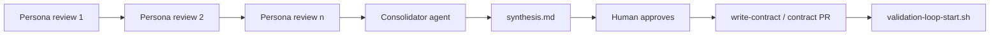

# Workflow: Product review (persona UX)

**Layer 1.** Simulates user feedback; does **not** replace Validator.

Load skill: `.cursor/skills/product-review/SKILL.md`  
Personas: [personas.md](../../docs/product-review/personas.md) — **Catalog A:** 12 sport × commitment · **Catalog B:** 8 role/onboarding

## Loop



## Step 1 — Persona review (one persona per Agent chat)

```
Product review: persona volleyball-host per docs/product-review/personas.md and .cursor/skills/product-review/SKILL.md.
iOS sim + Monrovia demo. Write docs/product-review/volleyball-host/YYYY-MM-DD-review.md + screenshots.
No code. No Validator.
```

Repeat for other persona-ids — **pickup batch** (6 sport personas) or **onboarding batch** (6 role personas) in `personas.md`.

## Step 2 — Consolidator (separate Agent chat)

After ≥3 reviews:

```
Consolidate all docs/product-review/**/*-review.md per .cursor/skills/product-review-consolidator/SKILL.md.
Write docs/product-review/consolidated/YYYY-MM-DD-synthesis.md. Propose contract diffs with cost estimates. No src/.
```

See [consolidate-product-reviews.md](./consolidate-product-reviews.md).

## Step 3 — Human → Layer 2 → Layer 3

Approve synthesis → contract PR → `./.cursor/hooks/validation-loop-start.sh {contract-id}`

## Not the same as

| | Product review | Consolidator | Validation |
|--|----------------|--------------|------------|
| Edits code | No | No (contracts only w/ approval) | Fixer yes |
| Hook chain | No | No | Yes |

## Master doc

[agent-development-layers.md](../../docs/agent-development-layers.md)
