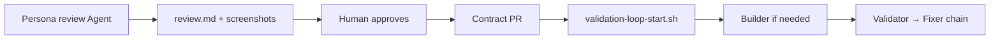

# Workflow: Product review (persona UX)

**Upstream of contracts.** Simulates user feedback; does **not** replace Validator.

Load skill: `.cursor/skills/product-review/SKILL.md`

## Loop



## Start (one Agent chat)

**Casual player:**

```
Product review: casual badminton player per .cursor/skills/product-review/SKILL.md.
Use iOS sim + Monrovia demo. Screenshot friction, write docs/product-review/casual/YYYY-MM-DD-review.md.
No code changes. No Validator.
```

**Hardcore organizer:**

```
Product review: hardcore badminton host per .cursor/skills/product-review/SKILL.md.
Focus Rally hub Play, lock roster, polls. Same output rules.
```

## Output checklist

- [ ] Screenshots under `docs/product-review/{persona}/`
- [ ] Prioritized friction table with suggested contract changes
- [ ] Explicit "not in scope for this persona"
- [ ] No app code diff unless user asked

## Handoff

Human → update contract → `./.cursor/hooks/validation-loop-start.sh {contract-id}` → existing validation chain.

## Not the same as

| | Product review | Validation |
|--|----------------|------------|
| Pass/fail vs contract | No | Yes |
| Uses hook chain | No | Yes |
| Can change code | No (default) | Fixer yes |
