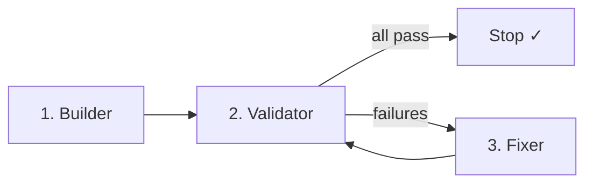

# Workflow: Validate a flow contract (Builder → Validator → Fixer)

Run **Loop A** or **Loop B** against a written contract. Three **roles** — usually three Cursor chats (or phases), not one auto-spawned pipeline.

**Contracts:** `docs/contracts/`  
**Human checklist:** `docs/contracts/MANUAL-RUN-loop-a.md` (Loop A)  
**Strategy:** [advisoragent.md](../../../advisoragent.md)

## Active loops

| Loop | Contract | Run after |
|------|----------|-----------|
| **A** | [flow-invite-to-rally.md](../../docs/contracts/flow-invite-to-rally.md) | — |
| **B** | [flow-rally-session.md](../../docs/contracts/flow-rally-session.md) | Loop A passes |

## Pre-flight (Validator)

```bash
cd RallyApp
npm start                    # Metro :8081 — leave running
npm run ios                  # another terminal if sim not booted
```

Seeds (linked preview, once per DB reset):

```bash
node scripts/seed-monrovia-basketball-rally-demo.mjs
supabase db query --linked -f supabase/scripts/seed_monrovia_basketball_rally_demo.sql
```

| Role | Account |
|------|---------|
| Host | `marcus@rally-mvrhoops.demo` |
| Tester | `@kunyu` |

Screenshot folder: `docs/contracts/screenshots/{contract-id}/` (filenames from each contract).

---

## The three roles



| Role | When | May change code? |
|------|------|------------------|
| **Builder** | Flow missing or large gap vs contract | Yes — only to match contract |
| **Validator** | Always after Builder or when checking regressions | **No** — run app, screenshots, pass/fail table only |
| **Fixer** | Validator reported specific failures | Yes — **only** failed checklist rows |

**Stop when:** all checklist items pass **or** the same failure repeats after **2–3** Fixer rounds → log in contract **Open issues** and stop.

## Hook chain rules (Validator MUST follow)

1. **End your turn after writing** `docs/contracts/.validation-session.json` — do **not** ask the human to "send to Fixer" or "tell Fixer". The `stop` hook submits Fixer automatically.
2. **`failed_rows`** must be **strings** (full checklist line + notes), never bare numbers like `[2, 4]`.
3. **Seed / SQL bug in repo** → `status: "fail"` → **Fixer** fixes SQL/scripts. You may run `supabase db query --linked -f …` yourself if CLI works.
4. **`blocked_external`** only when Agent cannot fix env in-session: wrong Supabase project, no network, no CLI, physical device required. **Not** for fixable seed SQL bugs.
5. **Sim tap / automation brittle** but product works → `fail` with Fixer row for `testID` / `accessibilityLabel` on action buttons — not `needs_human`.
6. If human interrupts mid-turn, they can run `./.cursor/hooks/validation-loop-continue.sh` to print the next Fixer/Validator prompt.

---

## 1. Builder — copy/paste prompt

Use when the flow is not implemented or you are starting fresh on a contract.

```
You are the Builder agent for Rally contract validation.

Read:
- RallyApp/docs/contracts/flow-invite-to-rally.md
- RallyApp/.cursor/workflows/validate-contract.md

Implement or fix the invite → auth → Rally flow until it matches the contract checklist and required states.

Rules:
- Do not change unrelated screens or add new product behavior beyond the contract.
- Match existing code patterns in surrounding files.
- Do not run validation or fill the pass/fail table — that is the Validator's job.

When done, list what you changed and which checklist items you believe are now satisfied.
```

**Loop B** — replace contract path with `RallyApp/docs/contracts/flow-rally-session.md` and purpose text (Rally hub → I'm in → lock roster).

---

## 2. Validator — copy/paste prompt

**Start here** if you only want to know pass/fail on the current build.

```
You are the Validator agent for Rally contract validation.

Read:
- RallyApp/docs/contracts/flow-invite-to-rally.md
- RallyApp/docs/contracts/MANUAL-RUN-loop-a.md
- RallyApp/.cursor/workflows/validate-contract.md

Validate Loop A on iOS simulator (tier 1). Do not fix code.

Steps:
1. Ensure Metro is running and iOS sim is booted (npm start, npm run ios).
2. Run deep-link tests via xcrun simctl openurl booted "rallyapp://..." (tokens from contract or DB query in MANUAL-RUN).
3. Test signed-out group invite, Today invite card (if seedable), logged-in group join, game invite, invalid token.
4. Capture screenshots to docs/contracts/screenshots/flow-invite-to-rally/ using filenames from the contract "Screenshots required" section.
5. Fill the Validator report template at the bottom of the contract (Pass/Fail + Notes for each row).
6. Tick pass/fail checklist items in the contract where appropriate.

Return:
- The completed pass/fail table (markdown).
- List of screenshot paths saved.
- Explicit list of failed rows only (for the Fixer).

If blocked (sim won't boot, DB unreachable, missing seed), log under Open issues and stop — do not guess fixes.
```

**Loop B** — replace with `flow-rally-session.md`; no MANUAL-RUN file; test host/member I'm in and lock roster per contract demo setup.

---

## 3. Fixer — copy/paste prompt

Use only after Validator returns failures. Paste the failed rows into the prompt.

```
You are the Fixer agent for Rally contract validation.

Read:
- RallyApp/docs/contracts/flow-invite-to-rally.md
- RallyApp/.cursor/workflows/validate-contract.md

Fix ONLY these failed checklist items from the Validator report:

[PASTE FAILED ROWS HERE — e.g. "3 | Today invite accept | Fail | No card on Today"]

Rules:
- Do not fix passing items.
- Do not add new behavior beyond what the contract requires.
- Do not change unrelated screens.
- Do not re-run full validation — tell the user to run Validator again.

When done, summarize the minimal diff and which rows should now pass.
```

---

## Recurring validation (`/loop`)

Re-runs **Validator only** on an interval. Example (Loop A):

```
/loop 20m You are the Validator agent. Read RallyApp/docs/contracts/flow-invite-to-rally.md and RallyApp/.cursor/workflows/validate-contract.md. Validate on iOS simulator tier 1. Return pass/fail table only; do not fix code. Stop reporting success if all rows pass. If the same row fails 3 times in a row, note it as a blocker in Open issues.
```

Dynamic pacing (no fixed interval):

```
/loop Validate Loop A per RallyApp/.cursor/workflows/validate-contract.md Validator prompt. Return pass/fail table; do not fix.
```

After a `/loop` tick reports failures → open a **Fixer** chat, then let the loop continue or run Validator once manually.

---

## Suggested session order

### First time on Loop A

1. **Validator** — baseline pass/fail on current build  
2. If failures → **Fixer** → **Validator** (repeat ≤ 3 times)  
3. If whole flow missing → **Builder** once, then **Validator**  
4. When all pass → start **Loop B** with same pattern  

### Regression before TestFlight

1. **Validator** only (tier 1 sim)  
2. **Fixer** only if needed  

### Friend beta (tier 2)

Human runs TestFlight install + link tap; Validator prompt can be adapted to "document results from tester" — no sim required for that row.

---

## Output checklist (Validator must deliver)

- [ ] Pass/fail table (all rows filled)
- [ ] Screenshots for each filename in contract (or note which were skipped and why)
- [ ] Contract checklist boxes updated or listed in report
- [ ] Failed rows explicitly listed for Fixer
- [ ] Open issues updated if blocked

---

## Related

| Doc | Purpose |
|-----|---------|
| [contracts/README.md](../../docs/contracts/README.md) | Contract index, demo accounts, deep links |
| [MANUAL-RUN-loop-a.md](../../docs/contracts/MANUAL-RUN-loop-a.md) | Step-by-step sim commands for Loop A |
| [cli-first skill](../skills/cli-first/SKILL.md) | Prefer `xcrun`, `supabase`, `npm` over asking the user |
