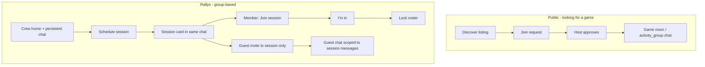

# Rally implementation plan (from advisor doc + product decisions)

**Source:** `ADVISOR_AGENT_UPDATE_2026-06-02.md`, gap review (2026-06), decisions below.  
**Status:** **Track A signed off** (2026-06-02) — **A0–A6** locked; **A7 deferred**. **Engineering build signed off** 2026-06-02 (collective QA pending). Migration **032** applied to Supabase. Execution checklist → `ADVISOR_IMPLEMENTATION_PLAN.md`.

| Item | Status |
|------|--------|
| A0 Track A gate (build per locked semantics) | **Signed off** |
| A1 Naming | **Locked — Rallys** |
| A2 Public / crew / guest | **Locked** |
| A3 I'm in / kick / penalties | **Locked** |
| A4 Session announcements | **Locked** |
| A5 Reliability v1 | **Locked** |
| A6 Legacy cleanup | **Locked** |
| A7 Unified game model | **Deferred** (post-beta ADR; no build) |

---

## How to use this doc

| Section | Purpose |
|---------|---------|
| **Decisions (locked)** | What we agreed — build toward these |
| **Open decisions** | Need discussion before engineering |
| **Product model** | Public vs Regulars vs guest — does it break one crew chat? |
| **Workstreams** | Phased, checkable tasks |
| **Discussion prompts** | For next product session |

---

## Locked decisions — Track A (semantics)

### A1 — Naming: **Rallys** ✅ Signed off

**Decision:** User-facing label for `regular_group` / persistent group is **Rallys** (brand: *rally* = gather).

**Canonical copy patterns:**

| Pattern | Example |
|---------|---------|
| Possessive | **Your Rallys** (list on Home / Profile) |
| Start / create | **Start a Rally** (onboarding, empty state, CTA) |
| Chat | **Pasadena Rally chat** (group name + “chat”) |
| One group | **a Rally** — “Join this Rally”, “Members of this Rally” |

**Avoid in UI:** “Crew”, “Regulars”, “Regulars group”, “Spoties” (internal code may still say `crew_group` / `regular_group`).

**Engineering:**

- DB/RPC: keep `regular_groups`, `crew_group`, `join_crew_game` (no rename in beta).
- Add `src/constants/productCopy.ts` — single source for Rallys strings.

**Tasks**

- [x] **A1-1** — **Rallys** (founder sign-off 2026-06-02).
- [x] **A1-2** — Copy pass: nav titles, Home, Create, Activity detail, Chats, invites, push text. **Built 2026-06-02.**
- [x] **A1-3** — `productCopy.ts` shipped; internal code still `crew` / `regular_group` (no DB rename).

---

### A2 — Public game vs Rally game (+ guests) ✅ Signed off

**Definitions (locked):**

| Type | User mental model | Who belongs |
|------|-------------------|-------------|
| **Public game** | “Looking for a game” — discovery, strangers, one-off or pickup | Host + approved players via join request; not a long-lived Rally |
| **Rally game** | “A game for this Rally” — session inside **your Rallys** | Rally members join session; host may invite **guests** |

**Guest rule (locked):**

- Guest is on the **roster per activity**, not a `regular_group_member`.
- Guest may **chat only in game/session context** for activities they’re on — not crew-wide history or unrelated sessions.

**Does this break “one chat per crew”?**

**No — if we scope access, not split conversations.**

Today we already have:

- One `crew_group` conversation per `regular_group`.
- `messages.activity_id` for session-scoped messages.
- `conversation_activities` linking sessions into that thread.

Guests do **not** require a second permanent chat per crew. They require **scoped membership + scoped message visibility**:

```
┌─────────────────────────────────────────────────────────┐
│  crew_group conversation (one per regular_group)        │
│  ├─ crew-wide messages (activity_id null)                 │
│  ├─ session A messages (activity_id = A)  ← guest sees  │
│  └─ session B messages (activity_id = B)  ← guest hidden │
└─────────────────────────────────────────────────────────┘
```

#### Guest in **two games** in the same Rally — does chat break?

**No.** One `crew_group` thread stays; access is **per activity**, not per Rally membership.

| Scenario | Behavior |
|----------|----------|
| Guest on session A only | Sees/posts messages with `activity_id = A` (+ that session’s system msgs) |
| Guest later added to session B | Sees A **and** B session slices; still **no** crew-wide (`activity_id` null) history |
| Inbox | **Two game/session rows** (or one row with picker), **not** a “Rally home” row |
| UI | Opening chat from session A vs B filters to that session; optional “Your games in this Rally” switcher for multi-game guests |

**Data model:** Prefer **one row per guest↔activity** (e.g. `join_requests` with `is_guest` / `participant_type = guest`), not a single `guest_activity_id` on `conversation_members`. RLS: `activity_id IN (guest’s approved activity ids)`.

**Does not break one-chat-per-Rally** — it breaks only if we store one activity id per guest member row without allowing multiples.

**Feasibility:** **Doable** — medium effort (RLS + UI filter + join path).

**What would break if done wrong:**

- Giving guests `regular_group_member` → they see all sessions + inbox “Regulars” row (wrong).
- Keeping separate `activity_group` for crew guests only → duplicate threads again (avoid).

**Recommended guest implementation (v1):**

| Layer | Approach |
|-------|----------|
| Roster | `join_requests` approved with `participant_type = 'guest'` OR flag `is_guest` on join row |
| Group | **Not** inserted into `regular_group_members` |
| Chat member | `conversation_members.role = 'guest'`; eligible activities from `join_requests` (guest), not `regular_group_members` |
| RLS | Guest: messages where `activity_id IN (approved guest activity ids)`; deny `activity_id IS NULL` crew-wide |
| UI | Session-scoped thread; banner: “Guest — this game only”; session picker if 2+ guest games in same Rally |
| Inbox | One row per guest session (or grouped); **no** Rally home row |
| Commitment | Guests use same **Join → I'm in → Lock roster** flow; reliability applies only if guest tapped **I'm in** before lock (same as members) |

**Guest invite (locked):** By **username** only for v1 (no guest invite link in v1).

**Guest vs member (locked):** A guest is **not** a Rally member until the host **explicitly invites** them to the Rally (separate from guest-on-game). Playing as guest does **not** auto-add to `regular_group_members`.

**Public game** stays separate for beta unless **A7** unifies:

- Still: join request → approve → game room.
- Copy: “Looking for players” not “Crew game”.
- Optional later: auto ephemeral crew (see **A7**).

**Tasks**

- [x] **A2-1** — UX copy: public vs Rally game labels + glossary. **Built 2026-06-02.**
- [ ] **A2-2** — Guest invite by username. **Engineering deferred** (semantics locked).
- [ ] **A2-3** — DB guest flag / multi-activity. **Deferred.**
- [ ] **A2-4** — RLS guest message scope. **Deferred.**
- [ ] **A2-5** — Chat filter for guests. **Deferred.**
- [ ] **A2-6** — Inbox guest vs member rows. **Deferred.**
- [ ] **A2-7** — QA guest isolation. **After A2-2–6.**
- [ ] **A2-8** — QA two guest sessions. **After A2-2–6.**

---

### A3 — “I'm in”, agreement, kick, penalties ✅ Signed off

**Aligned with advisor §7.1**, with founder rules:

| Rule | Behavior |
|------|----------|
| Join | Tentative roster slot — **no reliability penalty** |
| Joined, never tapped “I'm in” | **No automatic penalty** — host must **kick / remove** unwanted players |
| I'm in | Commitment if still on roster at **lock** |
| Lock roster | Final roster; reliability / attendance counts apply from here |
| Before lock | User may leave after reviewing roster — **no penalty** if game never finalized |
| Host responsibility | Host reviews roster, requests agreement if needed, **kicks** non-committal players before lock |
| Host kick | Allowed before lock; clears slot; no flake record if never finalized |
| After kick | Player **may re-join** the same session if spots open — kick does **not** block re-join (v1) |

**Explicit:** We do **not** auto-penalize “joined but not I'm in”. Operational fix is **host kick**, not system punishment.

**Tasks**

- [x] **A3-1** — Glossary + copy (Join / I'm in / lock). **Built 2026-06-02.**
- [ ] **A3-2** — `request_roster_confirmation` + notification. **Deferred** (optional v1).
- [x] **A3-3** — `remove_from_roster` + Game Room kick UI. **Built 2026-06-02 (032).**
- [x] **A3-4** — Reliability rules in `get_user_attendance_stats`. **Built 2026-06-02.**
- [~] **A3-5** — Host kick UI done; “Host asked you to confirm” **deferred** with A3-2.
- [x] **A3-6** — Leave-game copy (existing flow). **Built.**

---

### A4 — Announcements: Rally + session ✅ Signed off

**Decision:** **Both** required.

| Level | Use | Storage (target) |
|-------|-----|------------------|
| **Rally (group)** | Long-lived (“We play Thursdays at Pasadena”) | `conversations.pinned_announcement` (exists) |
| **Session** | Per game announcement (“Court 3, bring cash…”) | **`activities.session_note`** (new) — this **is** the session announcement |
| **Session cost** | Optional cost line on cards | **`activities.cost_note`** (exists) — keep separate from announcement |

**Locked:** Session-level announcement = **`session_note`**, not the Rally pin and not `cost_note`. Host edits session note when scheduling or from game detail / session card.

Do not overload one field for both (advisor §7.2).

**Tasks**

- [x] **A4-1** — Migration 032. **Applied 2026-06-02.**
- [x] **A4-2** — Session note on cards + detail. **Built.**
- [x] **A4-3** — Host edit session note on Activity Detail (Rally pin = existing). **Built.**
- [ ] **A4-4** — QA §8.8 pins isolation. **Collective QA.**

---

### A5 — Attendance / reliability v1 ✅ Signed off

**Decision:** **Yes** — implement advisor formula with confidence bands (only **committed** sessions: “I'm in” + locked roster).

```text
Reliability = confirmed_attended / committed_sessions

committed_session = player tapped "I'm in" AND roster locked AND game not cancelled
```

Bands: &lt;3 games → “New player”; 3–9 → soft label; 10+ → show %.

Exclude: host cancel, weather cancel, left before lock, waitlisted. **Guests included** if they tapped **I'm in** before lock (same rule as members).

**Tasks**

- [x] **A5-1** — `get_user_attendance_stats` RPC. **032 applied.**
- [x] **A5-2** — Profile + `PlayerTrustLine`. **Built.**
- [x] **A5-3** — Post-game attendance → `game_attendance`. **Built.**
- [ ] **A5-4** — Anti-gaming / dispute. **Deferred.**

---

### A6 — Legacy RSVP / per-activity crew chats ✅ Signed off

**Decision:** **Yes** — hide from inbox; keep DB; route deep links to `crew_group` where possible.

**Tasks**

- [x] **A6-1** — Deactivate legacy `activity_group` members for Rally games. **032 applied.**
- [x] **A6-2** — Inbox dedupe (030/031) + legacy hide. **Built — verify in QA.**
- [ ] **A6-3** — Message merge into crew thread. **Deferred** (risky).
- [ ] **A6-4** — Drop `activity_rsvps`. **Deferred** (post-analytics).

---

### A7 — Unified model (every game = crew with one activity) ⏸ Deferred

**Decision:** **Deferred** — keep current split through beta; revisit after crew loop is proven. No engineering until ADR approved.

**Options to discuss later:**

1. **Status quo** — Public = discover + `activity_group`; crew = `crew_group` (advisor default).
2. **Ephemeral crew** — Each public game creates short-lived `regular_group` + one session; archives after play.
3. **Full unify** — All games use crew session machinery; discover = guest-friendly join on ephemeral crew.

**Tasks**

- [ ] **A7-1** — ADR workshop (1 pager: data model, inbox, migration, cost).
- [ ] **A7-2** — No engineering until A7-1 approved.

---

## Product model diagram (target)



---

## Workstreams (execution order)

### Phase 0 — Decisions & copy (1 week)

| ID | Task | Owner | Depends |
|----|------|-------|---------|
| A1-2 | Glossary + UI copy pass (**Rallys**, Start a Rally) | Eng | A1 ✅ |
| A2-1 | Public vs crew strings | Eng | A1-1 |
| A7-1 | ADR scheduled (no build) | Product | — |

### Phase 1 — Stabilize & validate (parallel)

| ID | Task | Ref |
|----|------|-----|
| IOS-01 | iOS local build runbook + clean rebuild | §8.12, NEXT_ITEMS |
| QA-01 | Run §8.1–8.7 smoke on preview | Advisor §8 |
| LEGACY-01 | A6-1, A6-2 | A6 |

### Phase 2 — Session announcements + commitment (core)

| ID | Task | Ref |
|----|------|-----|
| A4-* | Session + crew announcements | A4 |
| A3-* | Agreement request, kick, pre-lock leave rules | A3 |
| A5-1, A5-2 | Reliability v1 display | A5 |

### Phase 3 — Guests (if approved in A2 spec)

| ID | Task | Ref |
|----|------|-----|
| A2-3–A2-7 | Guest roster + scoped chat | A2 |

### Phase 4 — Home & retention polish

| ID | Task | Ref |
|----|------|-----|
| HOME-01 | Dynamic Home cards (§5.1 wireframe) | Advisor §6.1 |
| POST-01 | Post-game attendance (§6.8) | A5-3 |
| WAIT-01 | Waitlist when session full | §5.2 |

### Phase 5 — Deferred (advisor §5.3)

Teams, leagues, payments, city expansion, public rankings, complex brackets.

---

## Glossary (signed off)

| Internal | User-facing |
|----------|-------------|
| `regular_group` | **Rally** (one) / **Rallys** (your list) |
| Create group CTA | **Start a Rally** |
| `crew_group` chat | **{Rally name} chat** |
| `conversation_activities` | **Game** / **session** (session card in chat) |
| Public `activity` (no group) | **Looking for a game** |
| Rally `activity` | **Game for this Rally** |
| `ready_at` | **I'm in** |
| `finalize` / locked | **Lock roster** |
| Guest participant | **Guest** (this game only; uses **I'm in**; not a Rally member) |
| `activities.session_note` | **Session announcement** (per game) |
| `activities.cost_note` | **Cost** (optional, separate line) |
| `conversations.pinned_announcement` | **Rally announcement** (whole group) |

---

## Discussion prompts (remaining)

**Also signed off (2026-06-02):**

| Topic | Decision |
|-------|----------|
| Guest invite | **Username** (v1) |
| Guest commitment | **Join + I'm in** — same as members; reliability only after **I'm in** + lock |
| Session announcement | **`session_note`** on activity = session announcement; **`cost_note`** stays for cost only |
| Rally announcement | **`conversations.pinned_announcement`** (unchanged) |

| Guest → member | **Only when host invites to Rally** — guest-on-game ≠ membership |
| Kick / re-join | **Kick does not block re-join** same session |

**Still open (deferred):**

1. **A7:** Ephemeral Rally per public game vs keep split — **deferred** until post-beta ADR (A7-1 only).

---

## Related docs

- `docs/ADVISOR_IMPLEMENTATION_PLAN.md` — **execution track** (phases 0–5, checkboxes)
- `docs/ADVISOR_AGENT_UPDATE_2026-06-02.md` — advisor review + wireframes + §8 QA
- `docs/NEXT_ITEMS.md` — engineering backlog from architecture review
- `docs/current-setup-app-guide.md` — iOS/Android run

---

*Last updated: 2026-06-02 — Track A complete except A7; guest ≠ member until Rally invite; kick allows re-join.*
