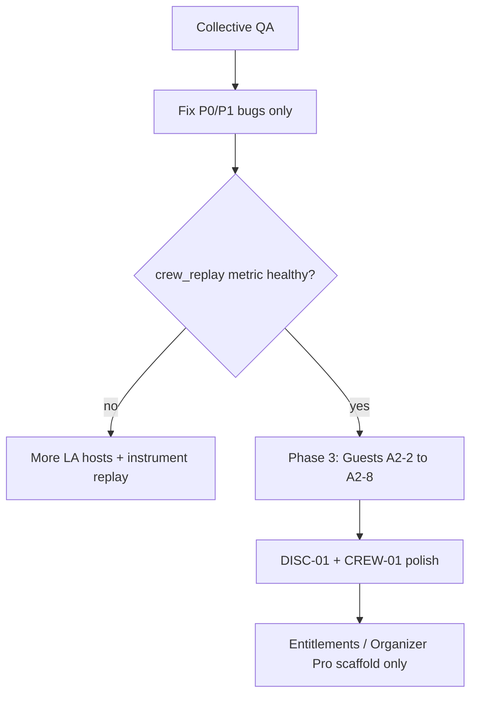

# What's next — after Track A build (2026-06-02)

**You are here:** Engineering for advisor **Track A (A0–A6)** is **built and signed off**. Migration **032** is on Supabase (`casljueycxsqexpkdiuq`). **Collective QA** is the gate before new features.

| Doc | Role |
|-----|------|
| **[PROJECT_STATUS_FOR_ADVISOR.md](./PROJECT_STATUS_FOR_ADVISOR.md)** | **Minimal context** — paste when asking for advice |
| [QA_BETA_CREW_CHECKLIST.md](./QA_BETA_CREW_CHECKLIST.md) | Run this on device (§8) |
| [QA_BUILD_HANDOFF.md](./QA_BUILD_HANDOFF.md) | Scope: built vs deferred |
| [ADVISOR_IMPLEMENTATION_PLAN.md](./ADVISOR_IMPLEMENTATION_PLAN.md) | Ticket checkboxes |
| [IMPLEMENT_PLAN.md](./IMPLEMENT_PLAN.md) | Locked semantics A1–A6 |
| [../open_items.md](../open_items.md) | Business roadmap + monetization gate |
| [../ROADMAP.md](../ROADMAP.md) | Engineering shipped/gaps |

---

## 1. Do now — collective QA

| Priority | Task | Owner |
|----------|------|--------|
| **P0** | Run [QA_BETA_CREW_CHECKLIST.md](./QA_BETA_CREW_CHECKLIST.md) on preview build (iOS + Android) | You |
| **P0** | Verify RPCs: `join_crew_game`, `set_session_note`, `remove_from_roster`, `submit_game_attendance`, `get_user_attendance_stats` | QA §8.13 |
| **P1** | File bugs only for **built** scope; don't file guest/A7/A6-4 as bugs | — |
| **P1** | **EAS preview rebuild** if testing TestFlight/Play internal ([NEXT_ITEMS.md](./NEXT_ITEMS.md) #17) | Eng |

**Exit:** QA-01–11 checked; no P0 regressions on crew loop (§8.4–8.7).

---

## 2. Shipped in Track A build (do not re-build)

- Rallys copy + glossary (`productCopy.ts`, `ProductGlossarySheet`)
- Dynamic Home hub (Next Up, host lock CTA, needs I'm in, games near you, Bring Rally)
- Session `session_note` + host edit; waitlist on full Rally games
- Join → I'm in → lock; host kick pre-lock; post-game attendance + reliability v1
- Legacy `activity_group` hide for Rally games (032)
- Create: public game default + link to Rally scheduling
- Profile: timezone + attendance-based reliability line
- Migrations **030 / 031 / 032** on preview

---

## 3. Deferred (explicit — next engineering after QA)

| ID | What | Why deferred |
|----|------|----------------|
| **A2 Phase 3** | Guest invite, `is_guest`, RLS, inbox split | Semantics signed off; medium build; after member loop QA |
| **A3-2** | `request_roster_confirmation` push | Optional v1 |
| **A6-3** | Merge legacy chat into crew thread | Risky |
| **A6-4** | Drop `activity_rsvps` | Post-analytics |
| **A7** | Public game = ephemeral Rally | ADR deferred |
| **DISC-01** | Discover filter polish | Post-QA |
| **CREW-01** | Rally profile reliability on all members | Partial |
| **Phase 5** | TOUR polish, Teams, Leagues, payments | Business gate: crew replay |

---

## 4. Recommended order after QA passes

1. **Fix QA bugs** in built scope (no scope creep).
2. **Watch** `analytics_crew_lifecycle.retained` — north star from [open_items.md](../open_items.md).
3. **If retention weak:** recruit 5–10 LA hosts; don't start paid features.
4. **If retention OK:** **Phase 3 Guests (A2)** then Discover/Rally profile polish.
5. **Monetization (Stages 4–7):** still blocked until replay metric proves retention.

---

## 5. NEXT_ITEMS.md reconciliation (architecture review)

| # | Item | Track A status |
|---|------|----------------|
| 1 | Profile attendance % | **Done** — reliability line + RPC |
| 2 | Merge legacy chat | **Deferred** — A6-3 |
| 3 | Session vs crew pins | **Done** — `session_note` + existing crew pin |
| 4 | Rallys naming | **Done** — A1 |
| 5 | Court photos | Open — roadmap |
| 6 | Host schedule UX | **Done** — schedule from chat/crew |
| 7 | Push jump-to-session | Open — polish |
| 8 | Drop `activity_rsvps` | **Deferred** — A6-4 |
| 9 | Orphan activity_group | **Done** — 032 |
| 10 | Inbox RPC perf | Open — if slow |
| 11 | Timezone UI | **Done** — TZ-01 |
| 12 | Roster trigger monitor | Open — ops |
| 13–14 | Constraints / indexes | Open — scale |
| 15 | Re-run beta seed | **Do after QA** if needed |
| 16 | Device QA crew loop | **= collective QA** |
| 17 | EAS preview rebuild | **Do for TestFlight** |

---

## 6. open_items.md reconciliation (business)

**Immediate build priority (2026-06-01)** — update mentally:

| Was P1 | Now |
|--------|-----|
| Dynamic Home | **Shipped** — QA |
| LA beta copy + CTA | **Shipped** |
| Migrations 026–028 | **Done**; **030–032** applied |
| Mini tournaments skeleton | **Shipped** — polish = TOUR-01 |
| Group RSVP / schedule next | **Shipped** (Rally path: I'm in / lock) |

**Still P0/P1 for product (not code):**

- Reliable preview install on tester phones
- Recruit 5–10 LA badminton/pickleball hosts
- Query `analytics_crew_lifecycle` for replay rate

**Still deferred:** Teams, Leagues, payments (Stages 4–7) until retention gate.

---

## Changelog

| Date | Change |
|------|--------|
| 2026-06-02 | Created post–Track A “what's next” hub; merged NEXT_ITEMS + open_items + IMPLEMENT_PLAN status |
