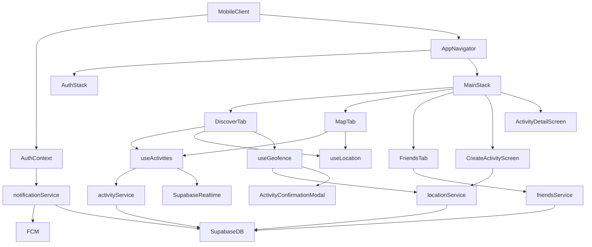
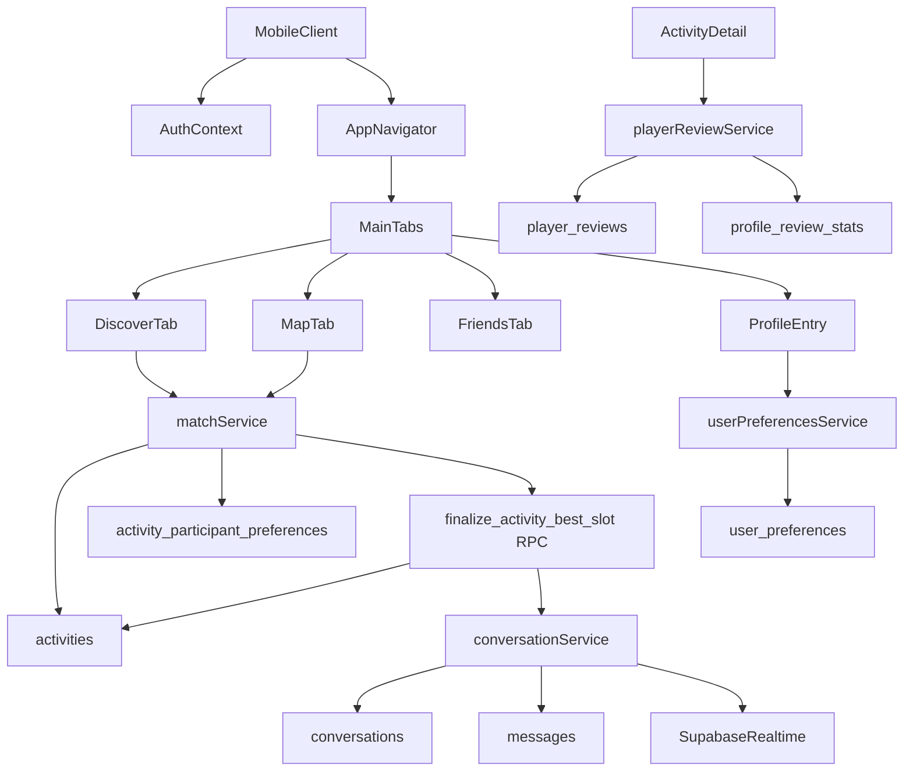
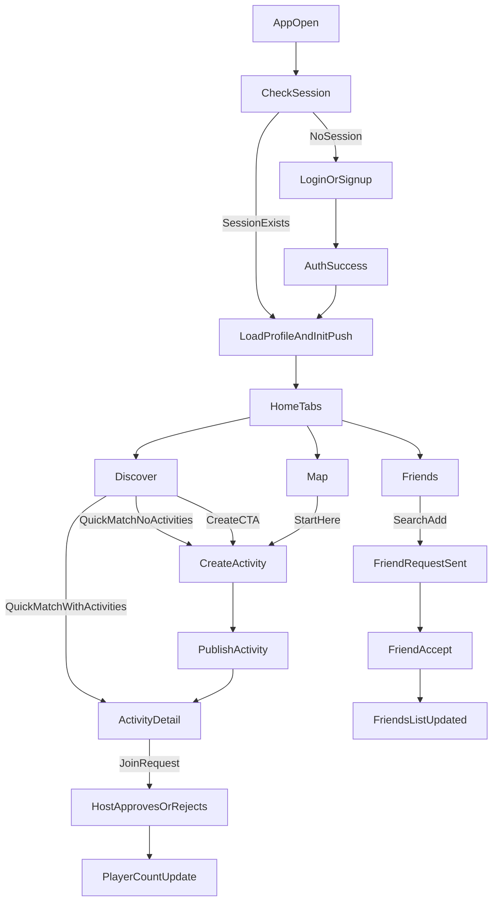
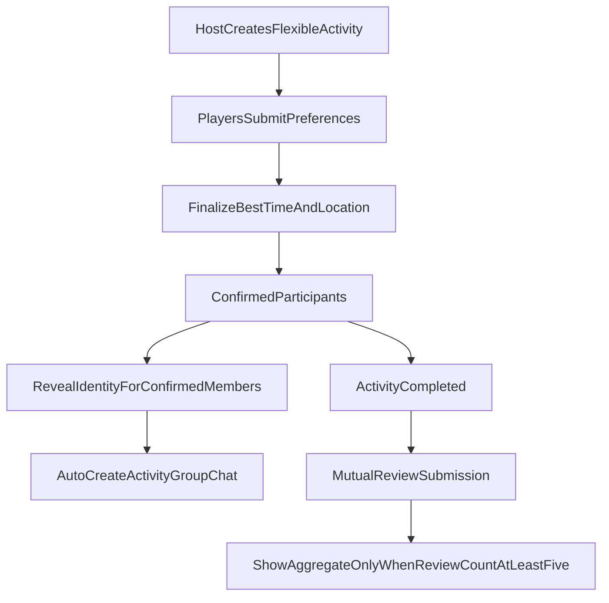

# RallyApp Current Setup + How It Works

Last updated: 2026-02-23

This document summarizes the current app setup, runtime architecture, near-term target architecture (V2.1), what you still need to do, and end-to-end test cases for all key features.

## 1) Current Setup Snapshot

### Stack

- React Native `0.83.x` + TypeScript
- Supabase (Auth + Postgres + Realtime)
- Firebase Cloud Messaging (push notifications)
- React Navigation (Auth stack + bottom tabs + activity stack)
- expo-location + geofence polling logic (Expo modules required on Android)

### Product Decisions Locked (V2.1)

- Activity creation default is **flexible optimization**:
  - Host sets constraints (time window, duration, candidate locations).
  - Joiners submit preferences.
  - System finalizes best time/location for confirmed participants.
- Identity visibility is **anonymous until confirmed**:
  - Before confirmation: anonymized player labels only.
  - After confirmation: confirmed participants see identities.

### Key Runtime Config

App config is loaded from environment variables through `react-native-config` in `src/constants/config.ts`.

Required:

- `SUPABASE_URL`
- `SUPABASE_ANON_KEY`

Optional:

- `GOOGLE_PLACES_API_KEY` (shared)
- `GOOGLE_PLACES_API_KEY_IOS`
- `GOOGLE_PLACES_API_KEY_ANDROID`
- `GEOFENCE_RADIUS`
- `LOCATION_UPDATE_INTERVAL`
- `LOCATION_DISTANCE_FILTER`

Template file: `.env.example`

### Viewing JavaScript logs (React Native 0.83+)

`console.log` / `console.warn` no longer appear in the Metro terminal. To see them (e.g. `[Location]` debug lines): focus the terminal where Metro is running and press **`j`** to open React Native DevTools, then use the **Console** tab.

### Android: location and why it now works

**Stack:** Location uses **expo-location** in this React Native (bare) app. For expo-location to work on Android, **Expo modules** must be configured: `expo` package and `expoAutolinking.useExpoModules()` in `android/settings.gradle`. Without that, the app crashes with `EventEmitter` undefined when using location (e.g. Create activity).

**How we get location:** `getCurrentPositionAsync` first; if it fails (e.g. emulator), we use `getLastKnownPositionAsync` so a cached or mock location from the last 5 minutes is used. Result: getCurrentPosition succeeds; location is visible in the in-app "Location debug" (dark) panel and Create activity no longer crashes. See [ANDROID-LOCATION-ISSUE-CONTEXT.md](ANDROID-LOCATION-ISSUE-CONTEXT.md) § Resolution.

**Set mock location (emulator):** Extended controls → Location → Enable GPS → Set location (after picking a point) → wait 2–3 s → in app, pull to refresh or tap Retry location. If it still fails, use a real device (below).

### Testing on a real Android device (not Expo)

This project is **React Native** (no Expo). Do **not** use `expo start`. (1) Phone: Developer options → USB debugging on; connect USB. (2) Terminal 1: `cd RallyApp && npm start`. (3) Terminal 2: `cd RallyApp && npx react-native run-android` — app installs on device and loads JS from Metro; location uses phone GPS. (4) If device on Wi‑Fi only: `adb reverse tcp:8081 tcp:8081`.

### Android emulator: set mock location (steps)

If you see "permission granted but no location" or location doesn’t resolve:

1. Open the emulator **Extended controls** (⋯ or three-dot menu) → **Location**.
2. Turn **Enable GPS signal** **ON**.
3. Either **click on the map** to place a pin, or select a **Saved point**.
4. Click **Set location** (the button must be enabled — if it’s greyed out, click the map or a saved point first so a location is selected).
5. **Wait 2–3 seconds** so the emulator injects the coordinates.
6. In the app, **pull to refresh** or tap **Retry location** on Discover.

### Native Notification Wiring (Current)

- iOS Firebase init in `ios/RallyApp/AppDelegate.swift` (guarded by presence of `GoogleService-Info.plist`)
- Android Google services plugin configured in:
  - `android/build.gradle`
  - `android/app/build.gradle` (applies plugin only when `google-services.json` exists)
- JS bootstrap:
  - background handler registration in `index.js`
  - foreground/open handlers in `App.tsx`
  - user token init/refresh in `src/context/AuthContext.tsx`

## 2) How The App Works (Current Runtime Architecture)



## 3) V2.1 Target Runtime Architecture (Planned)



## 4) User Flow Visualization



## 5) V2.1 User Flow Visualization (Planned)



## 6) Feature Inventory (Current Behavior)

- **Auth**
  - Email signup/login supported
  - Deep-link callback path: `rallyapp://auth/callback`
  - Profile auto-create fallback when authenticated user has no profile row
- **Discover**
  - Nearby feed, sport filters, loading/empty states
  - `Quick Match` routes to first activity or create flow fallback
  - Geofence detection hook can trigger activity confirmation modal
- **Map**
  - Activity pins + sports location pins
  - Fallback region behavior
  - `Start Here` route to create activity
- **Create Activity**
  - Select location, sport, duration, visibility, open slots
  - Creates activity and routes to detail screen
- **Activity Detail**
  - Join request action for non-host
  - Host pending request list with approve/reject
- **Friends**
  - Friends list
  - Incoming/outgoing request states
  - User search and add flow
- **Notifications**
  - Permission request and token registration lifecycle
  - token refresh sync
  - foreground/background/cold-open handler wiring

## 7) Action Items You Still Need To Do

## Critical (Blockers Before Release)

- Add real Firebase config files:
  - `ios/RallyApp/GoogleService-Info.plist`
  - `android/app/google-services.json`
- Populate `.env` from `.env.example` with real Supabase + Places values.
- Run native dependency sync:
  - iOS: `cd ios && pod install`
- Validate real device push path (Firebase Console -> device token in `user_device_tokens`). See **Validate real-device push path** below.

### Validate real-device push path

**Goal:** Confirm a device token is stored and that a test push sent from Firebase Console is received on the real device.

**Preconditions:** Firebase config files in place; app builds; APNs configured in Firebase for iOS. Use a **real device** (simulator/emulator push is unreliable).

1. **Get a token into `user_device_tokens`**
   - Run the app on a real device: `npx react-native run-ios` or `npx react-native run-android`.
   - Sign in with a test account.
   - Grant notification permission when prompted.
   - Wait a few seconds for token registration (handled in `AuthContext` / `notificationService`).

2. **Confirm the token is present**
   - In **Supabase** → **Table Editor** → open `user_device_tokens`.
   - Or run in **SQL Editor**:
     ```sql
     SELECT user_id, device_token, platform, created_at, updated_at
     FROM user_device_tokens
     ORDER BY updated_at DESC
     LIMIT 20;
     ```
   - Find the row for your test user and copy the `device_token` value (long string).

3. **Send a test push from Firebase Console**
   - Open [Firebase Console](https://console.firebase.google.com) → your project.
   - Go to **Engage** → **Messaging** (or **Build** → **Cloud Messaging**).
   - Click **Create your first campaign** / **New campaign** → **Firebase Notification messages**.
   - Enter a **Notification title** and **Notification text** (e.g. "Rally test", "Push path check").
   - Click **Send test message** (or **Next** until you see test options).
   - Paste the **device token** from step 2 into the field and add the device, then send the test.

4. **Verify on device**
   - With the app in foreground, background, or killed: the test notification should appear (and tapping it should open the app if applicable).
   - **Acceptance:** Token is present in `user_device_tokens` and at least one test push is received on the device. You can then check the task in `docs/TASKS.md` as done.

**Troubleshooting:** If no token appears in `user_device_tokens`, check that Firebase config files are present and that the app requested and was granted notification permission. For iOS, ensure APNs is set up in Firebase (Project settings → Cloud Messaging). For more cases (foreground/background/cold start), use `docs/phase-4-notifications-validation-checklist.md`.

## V2.1 Foundation (New Priority)

- [x] Add flexible matching migration file (`supabase/migrations/003_flexible_matching.sql`).
- [x] Add review and chat migration file (`supabase/migrations/004_reviews_and_chat.sql`).
- [x] Add profile and preferences migration file (`supabase/migrations/005_profile_preferences.sql`).
- [x] Implement initial runtime wiring:
  - `src/services/activityService.ts` (preference upsert + finalize RPC)
  - `src/services/chatService.ts` (conversation RPCs + messages + realtime subscription)
  - `src/services/reviewService.ts` (review submit/stats/identity visibility helper)
  - `src/pages/Profile/ProfileScreen.tsx`
  - `src/pages/Chat/ChatListScreen.tsx`
  - `src/pages/Chat/ChatThreadScreen.tsx`
  - `src/pages/Activity/ActivityDetailScreen.tsx` (submit availability/finalize/open group chat)
  - `src/pages/Friends/FriendsScreen.tsx` (open direct chat)
- [x] Add dedicated `reviewService` and post-match review UI screen.
- [x] Add unread badges and read-state sync for chat.
- [ ] Add moderation/report flow for chat.

## Validation + Signoff

- Complete Phase 3 run on both iOS and Android:
  - `docs/phase-3-partner-matching-validation-checklist.md`
  - record outcomes in `docs/phase-3-validation-results.md`
- Complete Phase 4 notification validation:
  - `docs/phase-4-notifications-validation-checklist.md`
- Complete release gate:
  - `docs/release-readiness-checklist.md`
- Complete V2.1 validation checklists:
  - `docs/phase-6-flexible-matching-validation-checklist.md`
  - `docs/phase-7-review-identity-validation-checklist.md`
  - `docs/phase-8-chat-validation-checklist.md`
- Record V2.1 results in:
  - `docs/phase-6-8-validation-results.md`

## Validation Window (Next 2-3 Days)

- Day 1:
  - Run `docs/archive/auth-profile-validation-checklist.md` (archived; revisit if needed)
  - Run `docs/phase-3-partner-matching-validation-checklist.md`
- Day 2:
  - Run `docs/phase-4-notifications-validation-checklist.md`
  - Run `docs/phase-6-flexible-matching-validation-checklist.md`
- Day 3:
  - Run `docs/phase-7-review-identity-validation-checklist.md`
  - Run `docs/phase-8-chat-validation-checklist.md`
  - Re-run failed cases and update release gate checklist.

## Product/Planning

- Review and prioritize V2/V3/V4 epics:
  - `docs/v2-v4-implementation-backlog.md`
- Break next sprint into deliverable tickets (owner + ETA + acceptance criteria).

## 8) Full Test Cases For Current Features

Use this as the master QA matrix. Run each case on iOS + Android unless marked platform-specific.

### A. Auth + Profile

**TC-A1 Signup success**

- Steps: open app -> sign up with new email -> complete flow
- Expected: authenticated session exists; profile row created/loaded; app lands in main tabs

**TC-A2 Login success**

- Steps: login with valid credentials
- Expected: app enters authenticated area; user data loads

**TC-A3 Invalid login**

- Steps: login with wrong password
- Expected: clear user-friendly error (`Invalid email or password`)

**TC-A4 Deep-link auth callback**

- Steps: trigger auth callback URL `rallyapp://auth/callback?...`
- Expected: session gets set/exchanged; app resumes authenticated state

**TC-A5 Sign out**

- Steps: Friends tab -> Sign out
- Expected: auth session cleared; token unregister attempt; app returns to login

### B. Location + Geofence

**TC-B1 Permission denied then re-enabled**

- Steps: deny location once -> enable in OS settings -> return app
- Expected: no crash; location-based data resumes

**TC-B2 Current location fetch**

- Steps: open Discover/Map with permission granted
- Expected: location resolves; nearby content loads

**TC-B3 Geofence modal one-shot behavior**

- Steps: stay near known sports location; wait polling interval
- Expected: confirmation modal appears; no endless repeat loop for same location

### C. Discover + Quick Match

**TC-C1 Discover load with data**

- Steps: open Discover where activities exist
- Expected: cards render with sport/host/time/player info

**TC-C2 Discover empty state**

- Steps: open Discover in area with no activities
- Expected: empty-state guidance + CTA to create

**TC-C3 Sport filter**

- Steps: tap sport chips
- Expected: list updates to selected sport

**TC-C4 Quick Match with activities**

- Steps: tap Quick Match when list is non-empty
- Expected: navigates to activity detail

**TC-C5 Quick Match without activities**

- Steps: tap Quick Match when list empty
- Expected: navigates to create activity

### D. Map

**TC-D1 Map activity pins**

- Steps: open Map with activities available
- Expected: activity markers visible and sheet list populated

**TC-D2 Sports-location pins without activities**

- Steps: open Map in no-activity area with seeded locations
- Expected: location markers still visible

**TC-D3 Start Here CTA**

- Steps: tap Start Here
- Expected: navigates to Create Activity

**TC-D4 Map refresh**

- Steps: tap refresh path in map flow
- Expected: location + activities refetch without crash

### E. Create Activity

**TC-E1 Create successful activity**

- Steps: choose location/sport/duration/visibility/open slots -> Create Activity
- Expected: success alert then route to Activity Detail; activity appears in feed/map

**TC-E2 No location selected guard**

- Steps: attempt create without effective location
- Expected: create button disabled or guard message shown

**TC-E3 Global fallback location list**

- Steps: no nearby locations -> load create screen
- Expected: fallback list appears with explanatory text

### F. Activity Detail + Join Requests

**TC-F1 Non-host join request**

- Steps: Account B opens Account A activity -> Request to Join
- Expected: one pending request row only (no duplicates)

**TC-F2 Host approve**

- Steps: Account A opens activity detail -> Approve request
- Expected: request status approved; player_count increments

**TC-F3 Host reject**

- Steps: host rejects pending request
- Expected: request status rejected; request removed from pending list

### G. Friends

**TC-G1 Search user**

- Steps: Friends -> Add tab -> search username/phone
- Expected: matching users listed (excluding self)

**TC-G2 Send friend request**

- Steps: tap Add on a user
- Expected: success alert; outgoing request appears in Requests tab

**TC-G3 Accept friend request**

- Steps: recipient account -> Requests -> Accept
- Expected: friendship appears for both users in Friends list

**TC-G4 Remove friend**

- Steps: Friends list -> Remove -> confirm
- Expected: friendship deleted and list refreshes

### H. Notifications

**TC-H1 Permission flow**

- Steps: first launch signed-in; respond to prompt
- Expected: grant/deny handled safely without blocking app

**TC-H2 Token registration**

- Steps: signed-in user with permissions granted
- Expected: `user_device_tokens` row created/upserted with platform and timestamps

**TC-H3 Token refresh**

- Steps: force refresh condition (reinstall/refresh event)
- Expected: refreshed token gets upserted; no duplicate `(user_id, device_token)` rows

**TC-H4 Foreground push**

- Steps: send test push while app foreground
- Expected: handler receives payload; app stays stable

**TC-H5 Background + cold-open push**

- Steps: send push in background and terminated states, tap notification
- Expected: open handlers fire and payload available for routing

### I. Realtime/Resync

**TC-I1 Activity realtime update**

- Steps: create/update activity from another account
- Expected: Discover/Detail updates via realtime subscription and refetch

**TC-I2 Manual refresh paths**

- Steps: pull-to-refresh on Discover/Friends
- Expected: data refresh succeeds without stale UI state

## 9) Suggested Execution Order For Testing

1. Auth + profile (`TC-A*`)
2. Location/geofence (`TC-B*`)
3. Discover/map/create (`TC-C*`, `TC-D*`, `TC-E*`)
4. Join/friends two-account (`TC-F*`, `TC-G*`)
5. Notifications (`TC-H*`)
6. Realtime/regression sweep (`TC-I*`)

## 10) Where To Update Status

- Product roadmap: `ROADMAP.md`
- Phase 3 test details: `docs/phase-3-validation-results.md`
- Phase 4 test details: `docs/phase-4-notifications-validation-checklist.md`
- Release gate: `docs/release-readiness-checklist.md`
- V2.1 test details:
  - `docs/phase-6-flexible-matching-validation-checklist.md`
  - `docs/phase-7-review-identity-validation-checklist.md`
  - `docs/phase-8-chat-validation-checklist.md`

## 11) EAS cloud builds + automated bundle

- **EAS project:** Linked under Expo account; project ID is in `app.json` (`expo.extra.eas.projectId`). Full steps (first-time Android/iOS credentials, preview builds): [eas-build-and-credentials.md](eas-build-and-credentials.md).
- **First cloud build:** Run `npx eas-cli credentials -p android` (and iOS) once so non-interactive builds can sign binaries.
- **Automated checks (no device):** From `RallyApp/`, run `./scripts/verify-release-bundle.sh` — runs `npm test` and `npm run lint`. Use before tagging preview/production builds.
