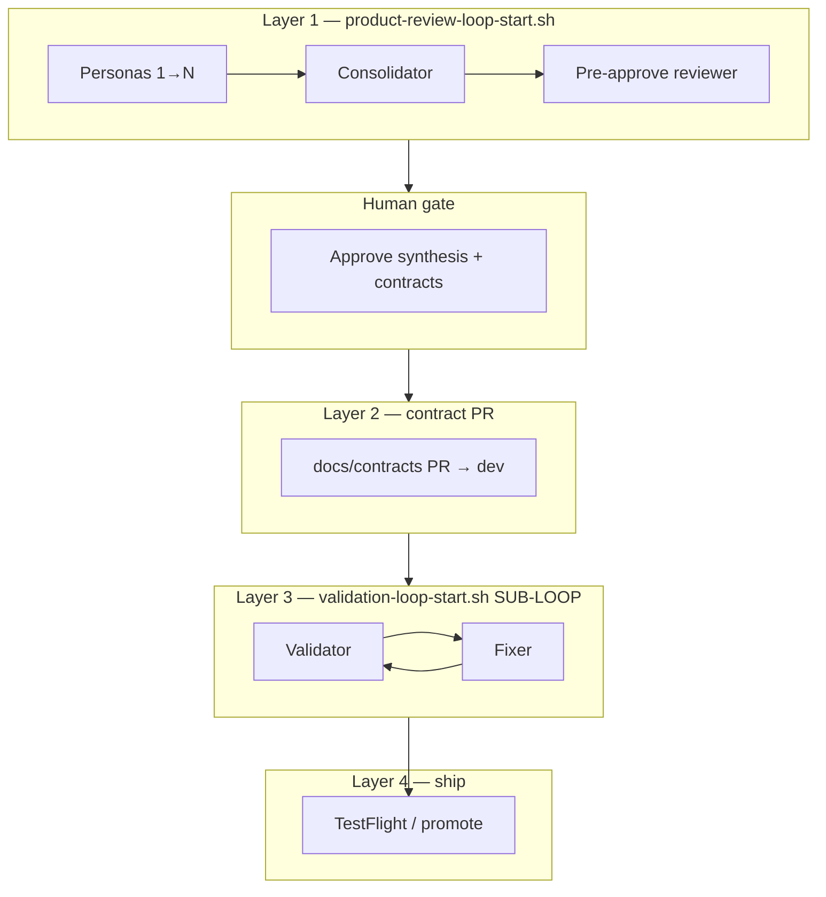

# Master loop — product review → proof → ship

**Maps sub-loops:** [release-loops.json](../release-loops.json)  
**Product review:** [PRODUCT-REVIEW-LOOP.md](./PRODUCT-REVIEW-LOOP.md) · `product-review-loop-start.sh`  
**Validation:** [VALIDATION-RUNBOOK.md](../contracts/VALIDATION-RUNBOOK.md) · `validation-loop-start.sh`

## Why validation felt automated but product review didn’t

| Design choice | Validation (Layer 3) | Product review (Layer 1) — before |
|---------------|----------------------|-------------------------------------|
| **Self-chain in one Agent turn** | ✅ Required in prompt | ❌ Was “tell human next step” |
| **`chain_enabled` session flag** | ✅ | ❌ Missing |
| **Sub-loop spawn** | Fixer → Validator | ❌ No link to validation |
| **Human gates** | Only `needs_human`, `blocked_external` | Pre-approve review → consolidator approve |
| **Multi-human reviewers** | N/A (one Agent proves build) | 6 real people = 6 sessions |

Validation automates **proof** (repeatable). Product review automates **tracking** but originally assumed **different humans per persona**.

**Now:** product review supports **`--chain`** (Agent self-chain like validation) and **`--human-assign`** (original multi-reviewer mode).

---

## The bigger loop (reference architecture)



**Sub-loops** (spawn when needed — do not merge into one script):

| Sub-loop | Start command | Self-chain? |
|----------|---------------|-------------|
| Product review | `product-review-loop-start.sh --queue onboarding-round1 --chain` | Personas → consolidator → pre-approve |
| Validation | `validation-loop-start.sh --queue cps-onboarding --builder` | Validator → Fixer → Validator |
| Sport feature | `validation-loop-start.sh --queue sport-meetup-launch --builder` | Same as validation |
| Tier 2 picky | `product-review-loop-start.sh --queue onboarding-round2-picky` | After L3 green |

Master config: **`docs/release-loops.json`** — which queues chain together for `onboarding-v1`, `pickup-gtm2`, `sport-meetup`.

**Round-by-round fixes & status:** [ROUND-LOG.md](./ROUND-LOG.md)

---

## One Agent turn (automated sim run)

```bash
cd RallyApp
./.cursor/hooks/product-review-loop-start.sh --queue onboarding-round1 --chain
```

Agent message:

```
Run product-review-loop-start.sh --queue onboarding-round1 --chain and self-chain all personas through consolidator and pre-approve reviewer in this turn. Stop at awaiting_human (read *-pre-approve-review.md).
```

After you approve:

```bash
./.cursor/hooks/product-review-loop-approve.sh   # only if auto-pass blocked
# chain-next → spawn_contract_pr → merge PR → product-review-loop-contract-merged.sh
# → builder → product-review-loop-builder-done.sh → validation
```

Agent (same or new chat):

```
Run product-review-loop-start.sh --queue onboarding-round1 --chain and self-chain through pre-approve.
If auto-pass eligible, continue to spawn_contract_pr in the same turn.
After contract PR merges, run product-review-loop-contract-merged.sh then builder B1–B6.
```

---

## Multi-human beta (6 real reviewers)

```bash
./.cursor/hooks/product-review-loop-start.sh --queue onboarding-round1 --human-assign
```

Each person gets **one persona** from session; after each review they (or you) run `product-review-chain-next.py`. No self-chain.

---

## What we learn from validation for the master loop

1. **Session file + `chain-next.py`** — single source of next role (both loops now).
2. **SELF-CHAIN in prompt** — Agent must not stop between steps when `chain_enabled`.
3. **Spawn sub-loops** — product review ends by **calling** validation loop, not reimplementing Fixer.
4. **Human gates stay explicit** — pre-approve review, consolidator approve, H* in contracts, `blocked_external`.
5. **Queues reference queues** — `review-queues.json` → `validation_queue` field → `validation-queues.json`.

---

## Your current state (onboarding-round1)

6/6 personas done · consolidator outputs exist → **pre-approve reviewer next**:

```bash
python3 .cursor/hooks/product-review-chain-next.py   # action=pre_approve_reviewer
```

Agent prompt:

```
Pre-approve review for queue onboarding-round1 per .cursor/skills/pre-approve-review/SKILL.md.
Read consolidator outputs + source persona reviews. Write *-pre-approve-review.md. Update session phase review_done.
```

Then human reads `*-pre-approve-review.md` → `./.cursor/hooks/product-review-loop-approve.sh`
