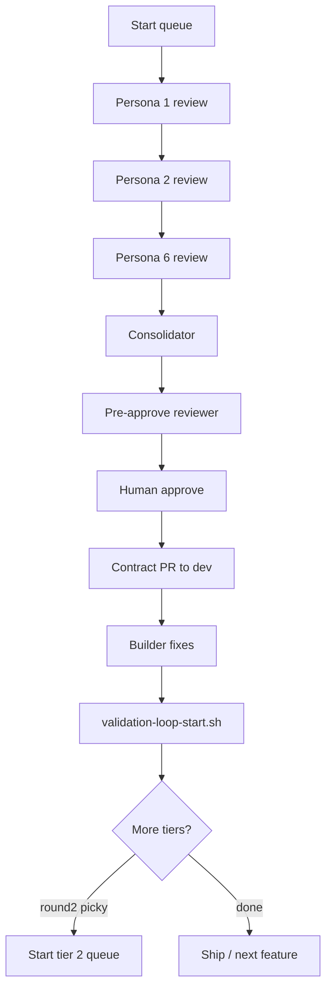

# Product review loop (Layer 1 → 2 → 3)

**Queues:** [review-queues.json](./review-queues.json)  
**Personas:** [personas.md](./personas.md)  
**Validation handoff:** [validation-queues.json](../contracts/validation-queues.json)

This is the **persona review loop** — separate from `validation-loop-start.sh`, but designed to feed it.

---

## The full loop (one cycle)



| Step | Who | Output |
|------|-----|--------|
| **1. Start queue** | You (terminal) | `.product-review-session.json` |
| **2. Persona reviews** | 6 people OR 6 Agent chats | `docs/product-review/{persona-id}/*-review.md` |
| **3. Consolidator** | 1 Agent chat | `consolidated/*-synthesis.md` + builder-backlog + validation-handoff |
| **3b. Pre-approve review** | 1 Agent chat (Layer 1.5) | `consolidated/*-pre-approve-review.md` — coverage + contract PR risk |
| **4. Human approve** | You | `./product-review-loop-approve.sh` (reads pre-approve verdict first) |
| **5. Contract PR** | Agent / you | `docs/contracts/*.md` updates → merge `dev` |
| **6. Builder** | Agent | `src/` fixes for P0/P1 backlog items |
| **7. Validator loop** | Agent | `./validation-loop-start.sh --queue …` |
| **8. Next tier** | You | `onboarding-round2-picky` when round 1 green |

---

## Start a queue

```bash
cd RallyApp
chmod +x .cursor/hooks/product-review-loop-start.sh
./.cursor/hooks/product-review-loop-start.sh --queue onboarding-round1
```

| Queue | Tier | Personas | After consolidate → validate |
|-------|------|----------|------------------------------|
| `onboarding-round1` | 1 | 6 role/onboarding | `cps-onboarding` |
| `pickup-round1` | 1 | 6 pickup/Rally | `gtm2-feedback-jun-2026` |
| `onboarding-round2-picky` | 2 | 6 stricter roles | `cps-onboarding` |
| `pickup-round2-picky` | 2 | 4 picky hosts | `gtm2-feedback-jun-2026` |
| `onboarding-round3-expert` | 3 | 4 edge cases | `cps-onboarding` |

Resume mid-queue:

```bash
./.cursor/hooks/product-review-loop-start.sh --queue onboarding-round1 --from parent-first-child
```

Check status:

```bash
./.cursor/hooks/product-review-loop-start.sh --queue onboarding-round1 --status
```

---

## Step 2 — One persona per person (NOT all 6 on one person)

Assign from session / queue list:

| Reviewer | Persona (onboarding-round1) |
|----------|----------------------------|
| Player tester | `player-no-coach-tools` |
| Coach candidate | `coach-approved-manual` |
| Parent A | `parent-first-child` |
| Parent B | `parent-via-class-invite` |
| Dual role | `coach-parent-dual` |
| Teen / policy | `teen-restricted-account` |

**Agent prompt (one chat per persona):**

```
Product review: persona {persona-id} per docs/product-review/personas.md and .cursor/skills/product-review/SKILL.md.
Queue onboarding-round1 tier 1. When done, update docs/product-review/.product-review-session.json (append to reviews_completed, phase persona_done) and run python3 .cursor/hooks/product-review-chain-next.py
```

After each review, session tracks progress — you do **not** need all 6 in one Agent turn.

---

## Step 3 — Consolidator (after 6 reviews)

When `reviews_completed` length ≥ 6, chain-next action = `consolidator`.

```
Consolidate per .cursor/skills/product-review-consolidator/SKILL.md for queue onboarding-round1.
Write synthesis + builder-backlog + validation-handoff under docs/product-review/consolidated/
Update session phase consolidate_done, status consolidated (not awaiting_human — pre-approve runs next).
```

**Consolidator outputs:**

| File | Feeds |
|------|-------|
| `*-synthesis.md` | Pre-approve reviewer + you |
| `*-builder-backlog.md` | **Builder** — P0/P1 code work |
| `*-validation-handoff.md` | **Validator** — contract order + queue name |

---

## Step 3b — Pre-approve review (before human gate)

After consolidator, chain-next action = `pre_approve_reviewer` (auto when `--chain` or `pre_approve_review_enabled: true`).

```
Pre-approve review for queue onboarding-round1 per .cursor/skills/pre-approve-review/SKILL.md.
Read consolidator outputs + source persona reviews. Write *-pre-approve-review.md. Update session phase review_done.
```

| Verdict | Meaning |
|---------|---------|
| `approve_ready` | Human can approve with confidence |
| `approve_with_notes` | Approve if you accept listed notes |
| `revise_consolidator` | Send back — fix synthesis/contracts before human gate |
| `block` | Do not approve — legal/GTM/conflict |

**Pre-approve checks:** persona coverage (P0/P1 not dropped), contract PR conflicts, vague checklist rows, missing H gates, lawyer/GTM timing.

---

## Step 4–7 — Approve → build → prove

Read `*-pre-approve-review.md` first, then:

```bash
# After pre-approve verdict is approve_ready / approve_with_notes:
./.cursor/hooks/product-review-loop-approve.sh

# Layer 3 (from handoff doc):
./.cursor/hooks/validation-loop-start.sh --queue cps-onboarding --builder
```

Builder reads `*-builder-backlog.md`. Validator runs the queue — same hook chain as today.

---

## Tier 2 / 3 — “More picky persons”

Each tier re-runs **different or overlapping personas** with a **stricter rubric** (see [personas.md](./personas.md) § Review tiers).

```bash
# After round 1 consolidated + validation mostly green:
./.cursor/hooks/product-review-loop-start.sh --queue onboarding-round2-picky
```

| Tier | Expectation |
|------|-------------|
| **1** | Discover friction; partial blocks OK to document |
| **2** | Must complete journey; silent fail = P0 |
| **3** | Edge cases, regressions, expert personas (`academy-head-coach`) |

You can run **pickup** and **onboarding** queues in parallel (separate session files — one active queue at a time; restart overwrites session).

---

## vs validation queue (`gtm2`)

| | Product review loop | Validation loop |
|--|---------------------|-----------------|
| Question | Should we change this? | Does build match contract? |
| Hook | `product-review-loop-start.sh` | `validation-loop-start.sh` |
| Parallel? | **Yes** — different layers | Can run while reviews in flight |
| Wait? | **No** — start onboarding reviews anytime after PR #43 merges |

---

## Session file

| File | Purpose |
|------|---------|
| `docs/product-review/.product-review-session.json` | Active queue progress (gitignored) |
| `.product-review-session.example.json` | Shape reference |
| `.product-review-next.md` | Last `chain-next` output |
| `.cursor/skills/pre-approve-review/SKILL.md` | Layer 1.5 — coverage + contract PR risk |
