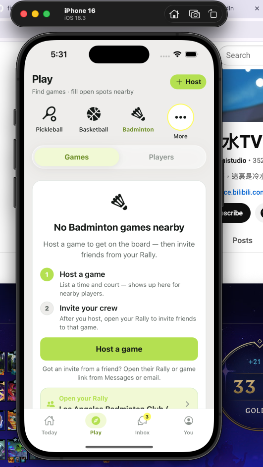

# Product review — play-ux-personalization-auditor · 2026-06-22

## Persona

**Role:** UX personalization auditor · **Level:** L3 regular · **Mindset:** *“Does Rally feel like it knows my sports, or like a static catalog?”*  
**Goal:** Multi-session Play usage — pick sports from More, switch segments, return next day — and judge whether the strip **learns** or merely **swaps slot 3**.  
**Contracts:** [flow-play-screen.md](../../contracts/flow-play-screen.md) · [module-sport-icon.md](../../contracts/module-sport-icon.md)  
**Queue:** `play-discover-round3-ux` tier 3 · **Not** a matrix pass/fail audit (see `play-sport-matrix-auditor`).

## Rubric (user perspective)

| Question | Fail signal |
|----------|-------------|
| After I pick a sport from More, does it stay **visible** without reopening More? | Selected sport only exists in slot 3; prior off-strip pick vanishes |
| Does the strip reflect **my** sports or **Rally’s** default LA order? | Pickleball + Basketball always occupy slots 1–2 for every account |
| If I use 4–5 sports, do they graduate onto the strip? | Strip hard-capped at 3 chips + More forever |
| Does re-opening Play feel continuous? | Last sport yes (`preferred_sports[0]`) but strip layout resets to global order |
| Would I describe this as “customized”? | Feels like a fixed promo row with one swap slot |

**Bar:** Tier 3 UX — not “no cross-sport leak”; **perfection** for repeat players.

## Setup

| Item | Value |
|------|-------|
| Device | iPhone 16 sim |
| Account | `@kunyu` or R0 `@playerr0pd1782160073` |
| Build | `dev` post–PR #61 (B7/B11) |
| Seed | Monrovia basketball + `@kunyu` Badminton free agent |

---

## Journey A — “I’m a Badminton player” (primary)

**Steps:** Open Play → More → Badminton → Games empty → Players (`@kunyu` row) → More → Racquetball → back to Badminton via strip.

### What the user sees (screenshot)



| Element | User read | Problem |
|---------|-----------|---------|
| Slots 1–2 | Pickleball, Basketball | **Not my sports** — LA beta defaults, never visited |
| Slot 3 | Badminton (selected) | Only here because B7 swapped slot 3 when I picked from More |
| More | Still required | Implies “your sport isn’t really on the strip” |
| Empty state | “No Badminton games nearby” | Content is correct; **chrome is not** |

**User quote (simulated):** *“I tapped Badminton in More. Why are Pickleball and Basketball still staring at me? This isn’t my row.”*

### Root cause (code)

```116:126:RallyApp/src/pages/Home/HomeScreen.tsx
  const stripSports = useMemo(() => {
    const primary = orderedPlaySports.slice(0, PLAY_STRIP_SPORT_COUNT);
    if (primary.some((sport) => sport.name === selectedSport)) {
      return primary;
    }
    const selected = orderedPlaySports.find((sport) => sport.name === selectedSport);
    if (!selected) {
      return primary;
    }
    return [...primary.slice(0, PLAY_STRIP_SPORT_COUNT - 1), selected];
  }, [orderedPlaySports, selectedSport]);
```

- `PLAY_STRIP_SPORT_COUNT = 3` — never grows.
- Slots 1–2 always `sortSportsForPlayTab` head (Pickleball, Basketball).
- Off-strip selection **replaces slot 3 only** — contract B7 minimum, not personalization.

```247:248:RallyApp/src/constants/sports.ts
/** Stable Play tab order — selection does not move chips (ring + label show active sport). */
export function sortSportsForPlayTab<T extends { name: string }>(sports: T[]): T[] {
```

Comment encodes the wrong product intent for tier 3.

**Contrast — Profile already has personalization logic:**

```21:52:RallyApp/src/utils/profileScorecardHelpers.ts
/** Sports played, most frequent first; ties follow Play tab order. Falls back to preferred sports. */
export function orderSportsAttended(
  games: MyGameEntry[],
  preferredSports: string[] = []
): string[] {
  // ... frequency sort ...
}
```

Play strip does **not** call `orderSportsAttended`. `preferred_sports` stores only `[lastSport]` — no history stack.

---

## Journey B — “Power user, 5 sports in a week”

**Simulated path:** More → Running → More → Racquetball → More → Table Tennis → More → Volleyball.

| Step | Expected (user mental model) | Actual |
|------|------------------------------|--------|
| After 2nd off-strip pick | Running **and** Racquetball visible on strip | Only latest in slot 3; Running gone |
| After 4th off-strip pick | Strip shows 4–5 recent sports; More = overflow | Still 3 + More; 3 slots are PB / BB / latest |
| Return tomorrow | Strip matches yesterday’s top sports | `preferred_sports[0]` restores **filter** only; strip layout still PB / BB / X |

**Verdict:** **Fail** personalization — we optimized for validator screenshot (slot 3 swap), not user habit.

---

## Journey C — Create Game parity

`CreateActivityScreen` uses identical `sportBarSports` pattern (`CREATE_GAME_SPORT_BAR_COUNT = 3`). Host creating Running meetup sees same global row. **Inconsistent** if Play ever gets smart strip — two surfaces should share one `buildPersonalizedSportStrip()` helper.

---

## What worked (don’t regress)

- Selected sport drives list/empty copy correctly (Badminton empty, `@kunyu` on Players).
- B11 empty hero icon centered — visual polish on content card.
- Persistence of **filter** on tab return (`preferred_sports[0]`).
- B7 is strictly better than “More pill only” selected state.

---

## Friction (prioritized — user lens)

| P | Screen | Issue | User impact | Suggested product behavior | Contract / code |
|---|--------|-------|-------------|---------------------------|-----------------|
| **P0** | Play sport strip | Strip is **global catalog**, not **my sports** | Repeat player feels app is generic; every session starts with Pickleball/Basketball | Build strip from `orderSportsAttended` + `preferred_sports` stack (MRU), cap 5, More = overflow only | `flow-play-screen` · new `buildPlayStripSports()` |
| **P1** | More → pick sport | Only **last slot** changes; prior off-strip picks evicted | Tapping More feels like a workaround, not onboarding my row | Promote picked sport to slot 1 (or insert at front); shift others right; drop tail into More | `HomeScreen.tsx` |
| **P1** | Strip capacity | Hard limit **3 + More** | 4th sport I care about always buried | `PLAY_STRIP_SPORT_MAX = 5` on wide phones; 4 on narrow; More when `sports.length > max` | `DiscoverSportFilters` scroll already supports |
| **P1** | `preferred_sports` | Single string `[sport]` | No memory of 2nd/3rd sport | Persist MRU array (max 5) on profile or local AsyncStorage | `userService` / schema |
| **P2** | More sheet | “All sports” flat grid — no **Recent** section | Power users re-scroll 12 icons | Sheet sections: **Recent** (strip overflow) · **All sports** | `SportPickerSheet.tsx` |
| **P2** | First visit | New user sees PB/BB/Badminton before playing | OK for LA beta **if** first pick immediately rewrites strip | First `preferred_sports` write should reorder strip same frame | onboarding hook |
| **P2** | Empty state steps | Step 1 still “court” for some court sports | Minor copy drift | Already noted in matrix audit | `DiscoverEmptyState` |
| **P3** | More a11y | Grid cells weak AX labels | Screen reader | `SportFilterIconItem` in sheet | matrix carry |

---

## Gap vs prior reviews

| Review | What it checked | What it missed |
|--------|-----------------|----------------|
| `play-sport-matrix-auditor` | Cross-sport rows, slot 3 visibility, empty icon | **Whether strip matches user identity** |
| `play-discover-minimalist` | Segment clutter (Classes hidden) | Strip ordering |
| Tier 2 synthesis B7 | “Off-strip sport in strip slot 3” ✅ | Equated **visible** with **personalized** |

**This is why tier 2 passed but the product still feels wrong** — contract checked engineering minimum, not user perfection.

---

## Recommended contract changes

- [ ] **Replace** “Strip order stays stable (`sortSportsForPlayTab`); only slot 3 swaps” with **personalized strip spec** (MRU + attended sports + max visible + More overflow).
- [ ] **Add** journey script: “Pick 3 different sports from More across 2 sessions → all 3 visible on strip without More.”
- [ ] **Add** screenshot: `personalized-strip-after-mru.png` (Badminton-first user → no Pickleball/Basketball unless played).
- [ ] **Fail** if slots 1–2 are global defaults while `preferred_sports` or attendance says otherwise.

## Recommended builder backlog (tier 3)

| ID | Priority | Item |
|----|----------|------|
| B16 | P0 | Personalized Play strip from MRU + `orderSportsAttended` |
| B17 | P1 | Extend visible strip to 4–5 sports; More = overflow |
| B18 | P1 | `preferred_sports` MRU array (max 5) |
| B19 | P2 | SportPickerSheet Recent section |
| B20 | P2 | Shared strip builder for Play + Create Game |

## Screenshots

| File | Capture |
|------|---------|
| `2026-06-22/01-badminton-slot3-global-defaults.png` | Badminton selected; PB/BB still slots 1–2 (user-provided) |

## Verdict

**Tier 2 matrix: PASS · Tier 3 UX personalization: FAIL**

Functionally correct filtering; **not** user-customized. Sport strip is the highest-traffic control on Play — shipping more features on top of a static row will keep circling back. **Recommend tier 3 builder round before new Play features.**
