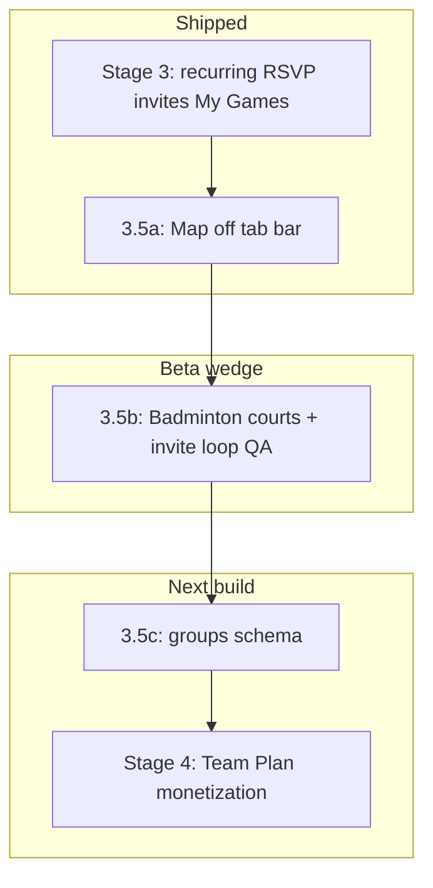

# Stage 3.5 — Beta Polish + Regulars Foundation

Last updated: 2026-06-01

Bridges **Stage 3 (partial)** and **Stage 4 (Team Plan)**. Three product bets from the June 2026 review, ordered by ship date.

## Overview

| Track | Idea | Roadmap slot | Status |
|-------|------|--------------|--------|
| **A** | Hide Map tab; courts from Discover | Stage 3.5a | **Shipped** |
| **B** | Badminton host invite loop (beta wedge) | Stage 3.5b | Docs + seed script |
| **C** | Regulars / Groups identity | Stage 3.5c → Stage 4 | Design only |

---

## 3.5a — Map deferral (shipped)

**Problem:** Map tab duplicated Discover, fuzzed pins, and added a 6th tab.

**Solution:**
- Remove Map from bottom tabs (5 tabs: Chats, My Games, Discover, Friends, Profile).
- Keep `MapScreen` on the root stack — **Discover → “Browse nearby courts on map”**.
- Re-enable as tab when map adds unique value (V2 presence, court-first browse).

**Exit:** Beta users reach courts without a dedicated tab; no regression in Create Game court picker.

---

## 3.5b — Badminton host invite loop (beta wedge)

**Problem:** Badminton is launch-enabled but LA has no seeded courts; sister’s friend group needs a **repeat play** path, not Discover strangers.

**Solution (ops + QA, minimal code):**

1. Run `node scripts/seed-la-badminton-courts.mjs` (service role).
2. Host flow (one account):
   - Profile → default sport **Badminton**
   - Create Game → pick seeded court → **Need players tonight** optional
   - After game day → **Make weekly recurring** → **Schedule next game**
   - **Share invite link** in iMessage/WhatsApp
3. Guest flow (second device): open `rallyapp://invite/{token}` → auto-join → Game Room → RSVP **Going**

**Success metric:** Same 4+ players play twice within 14 days without using Discover.

**Doc:** [smoke-test-badminton-invite-loop.md](./smoke-test-badminton-invite-loop.md)

**Later (Stage 3 remainder):** In-app “Host your first weekly game” coach marks on Create + share sheet.

---

## 3.5c — Regulars / Groups (design → Stage 4)

**Problem:** Recurring series is **per-game UUID**; users think in **“our Tuesday crew”**, not activity rows.

**Proposed model (not built yet):**

| Entity | Purpose |
|--------|---------|
| `groups` | Name, sport, default court, host |
| `group_members` | Roster (roles later) |
| `group.series_id` | Links to existing `game_series` |
| Game Room header | “Monrovia Badminton Regulars” not just court name |

**Why before Team Plan:** Groups are the emotional container; Team Plan sells **tools on top** (waitlist, blast, analytics).

**Build order:**
1. Schema + “Create group from this game” (host)
2. Invite link joins **group + next occurrence**
3. Chats tab: group row above game threads
4. Stage 4: paid organizer dashboard on group

**Defer until:** 3.5b shows ≥2 hosts running weekly games manually.

---

## Where this sits in ROADMAP phases

| Phase | Includes |
|-------|----------|
| Stage 3 (partial) | Recurring, RSVP, invites, My Games, tonight, badminton sport flag |
| **Stage 3.5** | Map deferral, badminton beta loop, groups design |
| Stage 3 (remainder) | Teams schema, game-time blast, sub board, auto-spawn cron |
| Stage 4 | Monetize groups/teams |

---

## Physical device beta

See [physical-device-beta-test.md](./physical-device-beta-test.md).
